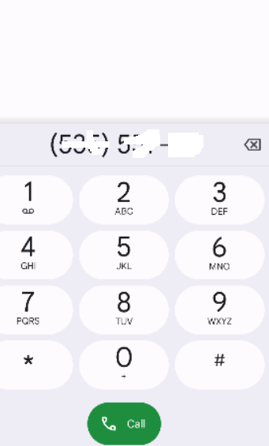
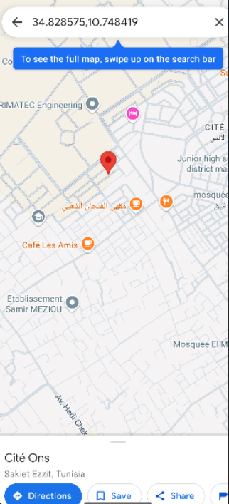

# OnsMall Student Housing

## Description
OnsMall Student Housing est une **application mobile Android** destinée aux étudiants de **Cité El Ons**.  
Elle permet de rechercher, consulter et réserver des logements disponibles, avec une interface simple et intuitive.

## Fonctionnalités principales
1. **Authentification** – Connexion sécurisée des utilisateurs  
2. **Enregistrement** – Création de comptes étudiants  
3. **Calendrier** – Gestion et visualisation des disponibilités  
4. **Téléphoner** – Appel direct aux propriétaires  
5. **Localisation** – Affichage des logements sur la carte  
6. **Page éditer profil** – Modifier les informations personnelles  
7. **Page ajouter home** – Ajouter un nouveau logement à la base  
8. **Page détails de la maison** – Voir toutes les informations détaillées sur un logement

## Captures d'écran
Voici quelques captures d'écran du projet :






> Les images sont extraites de la présentation PowerPoint du projet.

## Technologies utilisées
- **Mobile :** Android (Java)  
- **Base de données :** Firebase, SQLite  
- **Cartographie :** Google Maps API

## Installation
1. Cloner le repository  
   ```bash
   git clone https://github.com/NourAbid01/OnsMallStudentHousing.git
